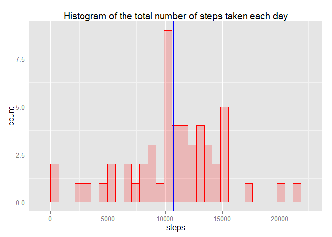
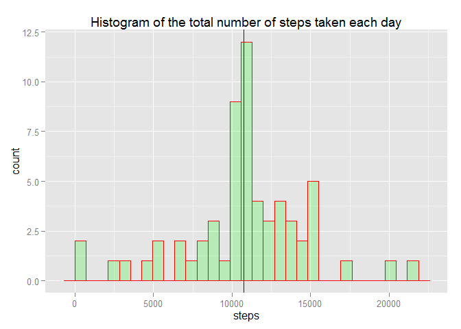
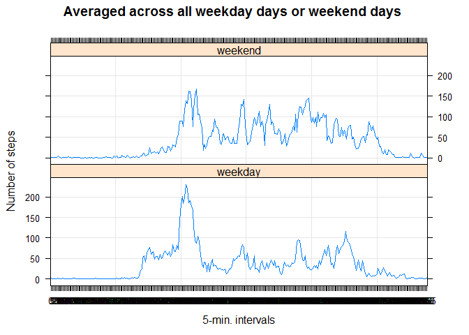

# Assesment1


```r
library(knitr)
library(ggplot2)
library(lubridate)
library(lattice)
opts_chunk$set(echo = TRUE, results = 'hold')
```
###Loading and preprocessing the data

* Read.csv()

* Process/transform the data (if necessary) into a format suitable for your analysis


```r
active_data <- read.csv("C:\\Users\\user\\Desktop\\activity.csv", header = TRUE, sep = ",",
                  colClasses=c("numeric", "character", "numeric"))
```


```r
active_data$date <- as.Date(active_data$date, format = "%Y-%m-%d")
active_data$interval <- as.factor(active_data$interval)
str(active_data)
```

```
## 'data.frame':	17568 obs. of  3 variables:
##  $ steps   : num  NA NA NA NA NA NA NA NA NA NA ...
##  $ date    : Date, format: "2012-10-01" "2012-10-01" ...
##  $ interval: Factor w/ 288 levels "0","5","10","15",..: 1 2 3 4 5 6 7 8 9 10 ...
```
###What is mean total number of steps taken per day?

*We ignore the missing values in the dataset*
* Calculate the total number of steps taken per day


```r
steps_per_day <- aggregate(steps ~ date, active_data, sum)

colnames(steps_per_day) <- c("date","steps")
```
* Plot histogram

* Calculate and report the mean and median of the total number of steps taken per day

```r
mean(steps_per_day$steps)
median(steps_per_day$steps)
```

```
## [1] 10766.19
## [1] 10765
```


```r
ggplot(steps_per_day, aes(x=steps))+geom_histogram(col="red", 
                 fill="red", 
                 alpha = .2) + 
  labs(title="Histogram of the total number of steps taken each day") +
  labs(x="steps") + geom_vline(xintercept = median(steps_per_day$steps), colour="blue", lwd=1)
```

 

###What is the average daily activity pattern?

*We calculate the aggregation of steps by intervals of 5-minutes and convert the intervals as integers and save them in a data frame called steps_per_interval.*

```r
steps_per_interval <- aggregate(active_data$steps,by = list(interval = active_data$interval), FUN=mean, na.rm=TRUE)
tail(steps_per_interval)
```

```
##     interval         x
## 283     2330 2.6037736
## 284     2335 4.6981132
## 285     2340 3.3018868
## 286     2345 0.6415094
## 287     2350 0.2264151
## 288     2355 1.0754717
```
* Convert interval to integers


```r
steps_per_interval$interval <- 
        as.integer(levels(steps_per_interval$interval)[steps_per_interval$interval])
colnames(steps_per_interval) <- c("interval", "steps")
```
* We make the plot with the time series of the average number of steps taken (averaged across all days) versus the 5-minute intervals:

```r
ggplot(steps_per_interval, aes(x=interval, y=steps)) +   
        geom_line(color="blue", size=1) +  
        labs(title="Average Daily Activity Pattern", x="Interval", y="Number of steps") +  
        theme_bw()
```

 


* Interval from 5-minute intervals, on average across all the days in the dataset, contains the maximum number of steps:

```r
max_interval <-steps_per_interval$interval[which.max(steps_per_interval$steps)]
max_interval
```

```
## [1] 835
```

###Inputing the missing values

*Note that there are a number of days/intervals where there are missing values (coded as NA).The presence of missing days may introduce bias into some calculations or summaries of the data.*

* Calculate and report the total number of missing values in the dataset (i.e. the total number of rows with NA’s)


```r
missing_vals <- sum(is.na(active_data$steps))
missing_vals
```

```
## [1] 2304
```


```r
str(steps_per_interval)
```

```
## 'data.frame':	288 obs. of  2 variables:
##  $ interval: int  0 5 10 15 20 25 30 35 40 45 ...
##  $ steps   : num  1.717 0.3396 0.1321 0.1509 0.0755 ...
```
 * Create a new dataset that is equal to the original dataset but with the missing data filled in.

```r
# replace missig values w
active_datafill <- active_data
for(r in 1:nrow(active_datafill)){
  if (is.na(active_datafill$steps[r])) {
    repl <- steps_per_interval$steps[steps_per_interval$interval == active_datafill$interval[r]];
    active_datafill$steps[r] <- repl;
  }
}
```
* Make a histogram of the total number of steps taken each day 

```r
steps_per_day1 <- aggregate(steps ~ date, active_datafill, sum)

colnames(steps_per_day1) <- c("date","steps")
ggplot(steps_per_day1, aes(x=steps))+geom_histogram(col="red", 
                 fill="green", 
                 alpha = .2) + 
  labs(title="Histogram of the total number of steps taken each day") +
  labs(x="steps") +geom_vline(xintercept = mean(steps_per_day1$steps), colour="blue")
```

 
* Calculate and report the mean and median total number of steps taken per day.

```r
mean(steps_per_day1$steps)
median(steps_per_day1$steps)
```

```
## [1] 10766.19
## [1] 10766.19
```
**estimates with and without missing data gives the same meaning for means and difference for medians.
For filling dataset the mean and median are the same.**

###Are there differences in activity patterns between weekdays and weekends?
*We use the dataset with the filled-in missing values*

* Create a new factor variable in the dataset with two levels – “weekday” and “weekend”

```r
active_datafill$day <- "weekday"
active_datafill$day[weekdays(as.Date(active_datafill$date), abb=T) %in% c("Sat","Sun")] <- "weekend"
table(active_datafill$day)
```

```
## 
## weekday weekend 
##   12960    4608
```

* Make a panel plot containing a time series plot


```r
average_number_steps <- aggregate(steps ~ interval + day, data=active_datafill, mean)
xyplot(steps ~ interval | day, data= average_number_steps, type="l", grid=T, layout=c(1,2), ylab="Number of steps", xlab="5-min. intervals", main="Averaged across all weekday days or weekend days ")
```

 
